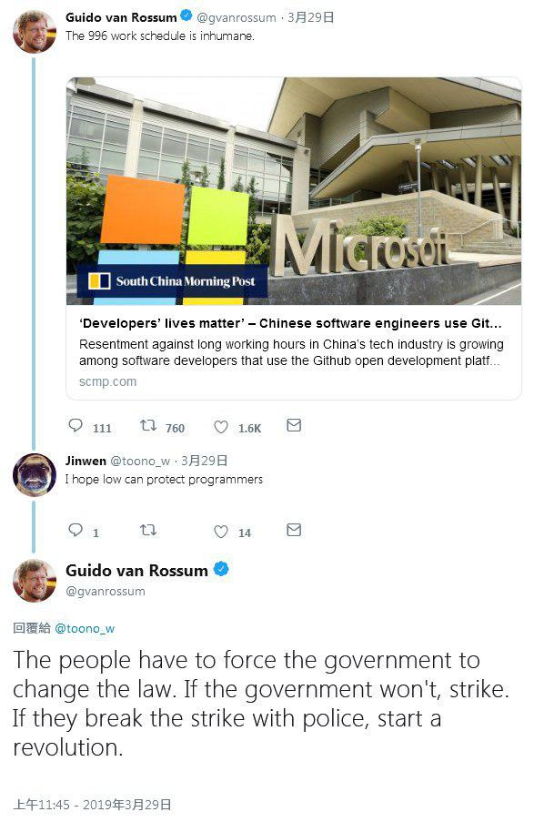
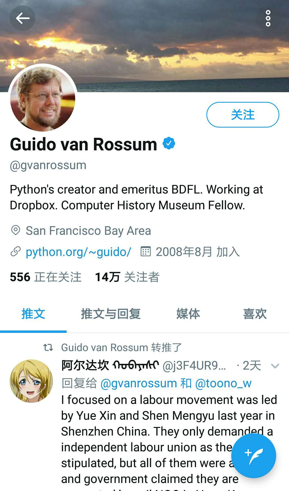
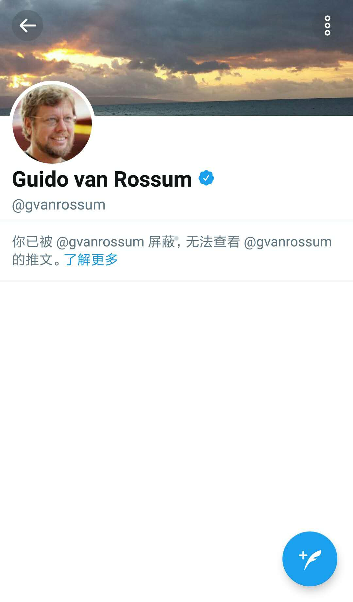

# Caution.996.ICU

* [English Version](./README_EN.md)

警惕！小心境外势力利用996.ICU传播反动造反言论，破坏我国稳定！  

最近Github出现一个反对996公司的组织：https://github.com/996icu/996.ICU 这是这些人和他们公司自己的问题，和其他人没多少关系，我国正规媒体中国青年报也作了报道没必要过于关注。  

但是到现在，有一些反动势力的论调裹挟其中，我们不得不站出来，提醒大家小心！比如这个吉多·范罗苏姆（Guido van Rossum)，作为Python创造者居然呼吁要在我国掀起革命！看看他说的：  

这些人必须迫使政府改变法律，如果政府不改就罢工。 如果政府警察禁止罢工，就要革命！  
(The people have to force the government to change the law. If the government won't, strike. If they break the strike with police, start a revolution.)

实在是太可怕了，居然想要革命，这是严重破坏我国稳定团结的论调！他身处旧金山湾区，但不去关注湾区谷歌员工的劳动权益反而来关注我国的劳动权益（ http://tech.ifeng.com/a/20190128/45301157_0.shtml ），难道真的是国际主义心态？查找公开资料，没有证据显示这家伙深入了解过中国，因此他对我国的印象大概就是西方媒体洗脑出来的，为什么他直接就想到要罢工要革命而不是要谈判妥善解决？这就是他对我国政府抱有敌意态度！

996.ICU项目本身没什么好说的，但是要高度警惕这些人利用996.ICU传播反动造反言论破坏我国稳定。在我们和他辩驳，之后他居然屏蔽了我们！！ 
[对于这家伙要高度警惕要抵制！！](https://medium.com/@jvbaoillegal/%E8%AD%A6%E6%83%95-%E5%B0%8F%E5%BF%83%E5%A2%83%E5%A4%96%E5%8A%BF%E5%8A%9B%E5%88%A9%E7%94%A8996-icu%E4%BC%A0%E6%92%AD%E5%8F%8D%E5%8A%A8%E9%80%A0%E5%8F%8D%E8%A8%80%E8%AE%BA-%E7%A0%B4%E5%9D%8F%E6%88%91%E5%9B%BD%E7%A8%B3%E5%AE%9A-916c66b38ede)

# 我们是谁
# who are we

我们是一群富有正义感的程序员，实在是看不惯境外网站一些内容对我国歪曲抹黑泼脏水了！所以我们主动出击，打击这些不实言论违法内容，保护我国网络主权！！  

了解一下我们最近对于学习强国违法刷分软件的举报！ https://github.com/boycott-fuck-xuexiqiangguo/Boycott-Fuck-XueXiQiangGuo 我们正义人士行侠仗义，在我们举报之后，ArchLinux AUR库的该违法软件已经被下线：https://aur.archlinux.org/packages/fuck-xuexiqiangguo/  

# 我们能做什么
# what can we do

借鉴996.ICU，我们也要起草个[Jvbao-LICENSE](jvbao-license)，凡是支持加星fuck-xuexiqiangguo那种违法作弊软件的，和gvanrossum这种蛊惑我们革命的都不能用我们正义人士的代码！正义人士都该添加我们的license！！  

更新这个[需要抵制的名单](boycottlist.md)和[需要高度警惕的名单](cautionlist.md)  
