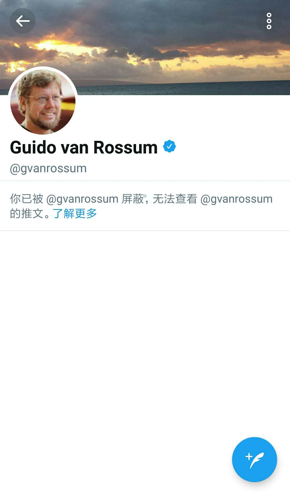

# Caution.996.ICU

Be caution of the use of 996.ICU by foreign forces to spread reactionary rebellious remarks to undermine our country's stability!
  
Recently a repo appeared on Github faighting against the "996" companies: https://github.com/996icu/996.ICU This is the problem of these employees and their own company. This has little to do with other people. China’s official media China Youth Daily also has made a report. So there is no need to pay too much attention to this repo.
  
But now, there have been some speeches from foreign reactionary forces. So we have to stand up and remind everyone to be careful! For example, Guido van Rossum, as the creator of Python, is calling for a revolution in China! Look at what he said:

(The people have to force the government to change the law. If the government won't, strike. If they break the strike with police, start a revolution.)
  
How terrible is this! He want a revolution??! These are speeches that will seriously undermines China’s stability and unity! Guido van Rossum is in the Bay Area, but he does not focus his attention to the human rights of Bay Area’s Google employees (https://www.wired.com/story/google-employees-report-declining-confidence-leaders/ ). Instead, he is paying attention to China’s human rights. Is he really an internationalist? There is no public report that this guy had a deep understanding of China. So his impression of China is a brainwashed result of the Western media. Why did he directly think we must strike or revolution instead of negotiating and properly solving it? This is his hostility towards our government!

The 996.ICU project by itself has not much to blame, but it is these people who using the 996.ICU to spread reactionary rebellious remarks to undermine our stability that are to blame. He had retweeted fake news comments, we reported and that twitter get deleted！After we debate with this guy, he blocked us!! We have to be careful, we have to boycott this guy!!!

# who are we
  
We are a group of programmers with a sense of justice. It is really not easy to get accustomed to the contents of overseas websites. Therefore, we take the initiative to crack down on these illegal content and protect our network sovereignty! !

Take a look at our recent boycott on illegal cheating software: https://github.com/boycott-fuck-xuexiqiangguo/Boycott-Fuck-XueXiQiangGuo After we reported abuse, the ArchLinux AUR repo has take down this illegal cheating software: https://aur.archlinux.org/packages/fuck-xuexiqiangguo/

# what can we do

Drawing on 996.ICU, we have to draft a [Jvbao-LICENSE](jvbao-license), and any person that supports cheating software like the fuck-xuexiqiangguo, and persons like gvanrossum who want a revolution to happen in our country, cannot use the justice of our code! People with a sense of justice should add our license to their project! !

Drawing on 996.ICU, we make this this [Boycott-List](boycottlist.md) and [Caution-list](cautionlist.md)
